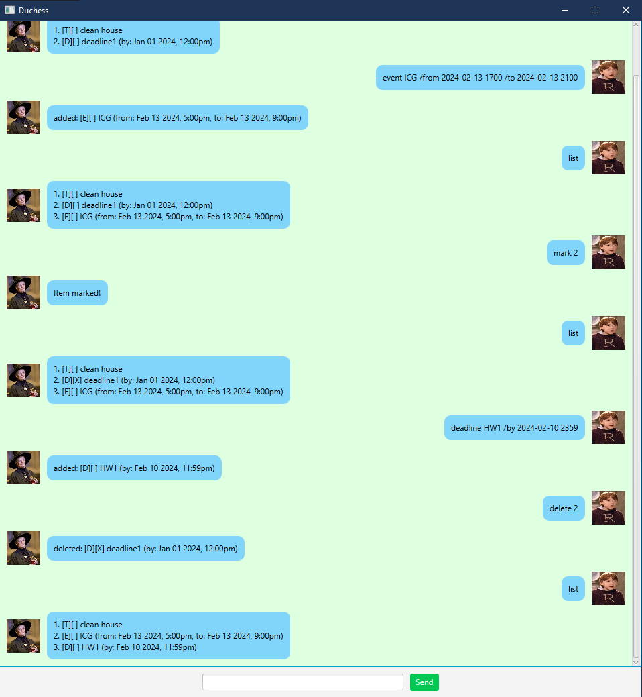

# Duchess User Guide



## Introduction
Duchess is a personal assistant chatbot that helps you manage tasks efficiently. It allows you to create and track different types of tasks, such as to-dos, deadlines, and events. You can also mark tasks as done, delete them, and view your task list.

## Adding Tasks
Duchess supports three types of tasks:

### Todo
Create a simple task without any deadlines.

**Command Format:**
```
todo <task>
```

**Example:**
```
todo clean house
```

**Expected Output:**
```
1. [T][ ] clean house
```

### Deadline
Create a task with a specific deadline.

**Command Format:**
```
deadline <task> /by <yyyy-MM-dd HHmm>
```

**Example:**
```
deadline HW1 /by 2024-02-10 2359
```

**Expected Output:**
```
added: [D][ ] HW1 (by: Feb 10 2024, 11:59pm)
```

### Event
Create an event with a start and end time.

**Command Format:**
```
event <task> /from <yyyy-MM-dd HHmm> /to <yyyy-MM-dd HHmm>
```

**Example:**
```
event ICG /from 2024-02-13 1700 /to 2024-02-13 2100
```

**Expected Output:**
```
added: [E][ ] ICG (from: Feb 13 2024, 5:00pm, to: Feb 13 2024, 9:00pm)
```

## Managing Tasks
Duchess allows you to manage tasks using the following commands:

### Mark a Task as Done
Marks a task as completed.

**Command Format:**
```
mark <index>
```

**Example:**
```
mark 2
```

**Expected Output:**
```
Item marked!
```

### Unmark a Task
Marks a completed task as not done.

**Command Format:**
```
unmark <index>
```

**Example:**
```
unmark 3
```

**Expected Output:**
```
Item unmarked!
```

### Delete a Task
Removes a task from the list.

**Command Format:**
```
delete <index>
```

**Example:**
```
delete 2
```

**Expected Output:**
```
deleted: [D][X] deadline1 (by: Jan 01 2024, 12:00pm)
```

## Viewing Tasks
Displays the current list of tasks.

**Command Format:**
```
list
```

**Example:**
```
list
```

**Expected Output:**
```
1. [T][ ] clean house
2. [E][ ] ICG (from: Feb 13 2024, 5:00pm, to: Feb 13 2024, 9:00pm)
3. [D][ ] HW1 (by: Feb 10 2024, 11:59pm)
```
